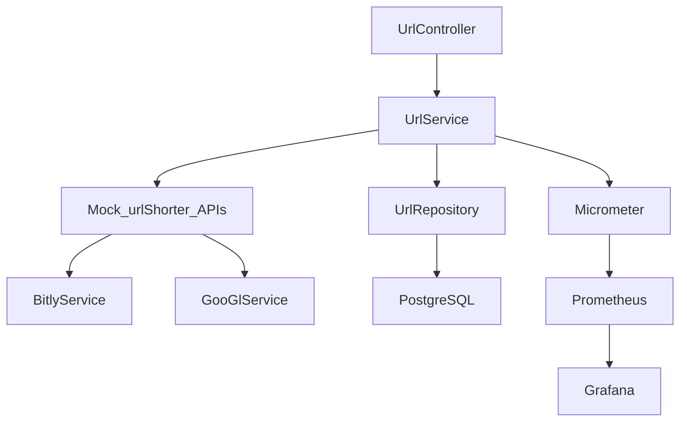

# Aplicación de UrlShorter

## Descripción General

La Aplicación de UrlShorter es un servicio web que permite a los usuarios crear versiones acortadas de URLs largas. Proporciona endpoints para acortar URLs, recuperar URLs originales, actualizar URLs y eliminar URLs. La aplicación está construida con Spring Boot e incluye la recopilación de métricas para estadísticas de acceso en tiempo casi real.

## Componentes

### 1. UrlController
- **Responsabilidad**: Maneja las solicitudes HTTP para operaciones de URL como acortar, recuperar, actualizar y eliminar URLs.
- **Por Qué Se Incluye**: Actúa como el punto de entrada para todas las interacciones del cliente con la aplicación.

### 2. UrlService
- **Responsabilidad**: Gestiona la lógica de negocio para operaciones de URL, incluyendo la creación, recuperación, actualización y eliminación de URLs.
- **Por Qué Se Incluye**: Separa la lógica de negocio del controlador, promoviendo una arquitectura limpia y mantenibilidad.

### 3. BitlyService
- **Responsabilidad**: Se integra con la API de Bitly para acortar URLs.
- **Por Qué Se Incluye**: Proporciona un servicio externo para acortar URLs, mejorando la funcionalidad.

### 4. GooGlService
- **Responsabilidad**: Se integra con la API de UrlShorter de Google para acortar URLs.
- **Por Qué Se Incluye**: Proporciona otro servicio externo para acortar URLs, ofreciendo flexibilidad.

### 5. UrlRepository
- **Responsabilidad**: Gestiona las operaciones de base de datos para entidades de URL.
- **Por Qué Se Incluye**: Abstrae las interacciones con la base de datos, permitiendo cambios fáciles en la capa de base de datos.

### 6. Url
- **Responsabilidad**: Representa la entidad URL en la aplicación.
- **Por Qué Se Incluye**: Modela la estructura de datos para URLs, asegurando consistencia e integridad.

### 7. Recopilación de Métricas
- **Responsabilidad**: Recopila y expone métricas para monitorear el rendimiento de la aplicación.
- **Por Qué Se Incluye**: Proporciona insights en tiempo real sobre el uso y el rendimiento de la aplicación, facilitando la resolución de problemas y la optimización.

## Infraestructura

### Base de Datos
- **Desarrollo y Pruebas**: H2
    - **Por Qué Se Eligió**:
        - **Rapidez**: H2 es muy rápida y se inicia en cuestión de segundos.
        - **Facilidad de Configuración**: No requiere una instalación compleja y se puede configurar fácilmente en aplicaciones Java.
        - **Compatibilidad**: H2 ofrece una sintaxis SQL similar a PostgreSQL, lo que facilita la migración entre ambientes de desarrollo y producción.
    - **Alternativas Consideradas**:
        - **SQLite**: Otra base de datos en memoria, pero H2 ofrece más características y mejor compatibilidad con PostgreSQL.
        - **Derby**: Una base de datos embebida de Apache, pero H2 es más moderna y tiene una comunidad más activa.

#### H2 Console - consola

1. en el browser ir a http://localhost:8080/h2-console
2. **Login** using the following credentials:

    - **Saved Settings**: `Generic H2 (Embedded)`
    - **Driver Class**: `org.h2.Driver`
    - **JDBC URL**: `jdbc:h2:mem:urlshortener`
    - **User Name**: `sa`
    - **Password**: (leave blank)

#### Configuracion

settings:

| Setting Name          | Value                           |
|-----------------------|---------------------------------|
| Driver Class          | `org.h2.Driver`                 |
| JDBC URL              | `jdbc:h2:mem:urlshortener`      |
| User Name             | `sa`                            |
| Password              | (leave blank)                   |


### Monitoreo y Métricas
- **Herramienta**: Micrometer con Prometheus y Grafana
- **Por Qué Se Eligió**:
   - **Micrometer**: Proporciona una fachada simple sobre los clientes de instrumentación para los sistemas de monitoreo más populares.
   - **Prometheus**: Una poderosa herramienta de monitoreo y alertas de código abierto.
   - **Grafana**: Una plataforma de monitoreo y observabilidad de código abierto, con una rica gama de herramientas de visualización.
- **Alternativas Consideradas**:
   - **New Relic**: Una herramienta APM completa pero con costos más altos.
   - **Datadog**: Otra herramienta APM con fuertes características pero también con costos más altos.

#### Acceso a Métricas

Las métricas se exponen a través del endpoint `/actuator/metrics` proporcionado por Spring Boot Actuator. A continuación se detallan los endpoints para acceder a las métricas específicas:

- **Lista de metricas disponibles**:
  - http://localhost:8080/actuator
- **Métrica de Solicitudes de Acortar URLs**:
  - http://localhost:8080/actuator/metrics/url.shorten.requests
- **Métrica de Solicitudes de Agregar URLs**:
  - http://localhost:8080/actuator/metrics/url.add.requests
  - **Métrica de Solicitudes de Eliminar URLs**:
    - http://localhost:8080/actuator/metrics/url.delete.requests
  - **Métrica de Solicitudes de Resolución de URLs**:
    - http://localhost:8080/actuator/metrics/url.resolve.requests
  - **Métrica de Solicitudes de Actualizar URLs**:
    - http://localhost:8080/actuator/metrics/url.update.requests

### Marco de Pruebas
- **Marco**: JUnit 5
- **Por Qué Se Eligió**:
   - **JUnit 5**: La última versión de JUnit, que proporciona características avanzadas como pruebas parametrizadas, pruebas anidadas y más.
- **Alternativas Consideradas**:
   - **TestNG**: Ofrece características similares pero JUnit 5 es más integrado con Spring Boot.

### Herramienta de Construcción
- **Herramienta**: Maven
- **Por Qué Se Eligió**:
   - **Maven**: Ampliamente utilizado en el ecosistema Java, con una gran comunidad y documentación extensa.
- **Alternativas Consideradas**:
   - **Gradle**: Ofrece más flexibilidad y compilaciones más rápidas pero con una curva de aprendizaje más pronunciada.

## Diagrama de Arquitectura

A continuación se muestra un diagrama de arquitectura de alto nivel de la Aplicación de UrlShorter.




### Explicación del Diagrama
- **UrlController**: Maneja las solicitudes HTTP e interactúa con los servicios.
- **UrlService**: Gestiona la lógica de negocio e interactúa con los repositorios.
- **Mock_urlShorter_APIs**: Se utiliza para simular servicios externos de acortamiento de URLs.
- **BitlyService & GooGlService**: Se integran con servicios externos de acortamiento de URLs.
- **UrlRepository**: Gestiona las operaciones de base de datos.
- **PostgreSQL**: Almacena datos de URL.
- **Micrometer**: Recopila y expone métricas.
- **Prometheus**: Recopila y almacena métricas.
- **Grafana**: Visualiza métricas.

### JMETER

## Configuración de Pruebas de Carga con JMeter

El archivo `HTTP Request.jmx` configura una prueba de carga para simular 84 usuarios concurrentes que realizan 100 solicitudes POST cada uno al endpoint `/api/add?method=b`. Cada solicitud envía un cuerpo JSON con una URL original y 30 días de retención. El tiempo de ramp-up es de 1 segundo, alcanzando una carga máxima de 84 usuarios en ese tiempo. El total de solicitudes es 8,400.

- **Número de Usuarios Simulados**: 84
- **Tiempo de Ramp-Up**: 1 segundo
- **Número de Iteraciones por Usuario**: 100
- **Método HTTP**: POST
- **Endpoint**: `http://localhost:8080/api/add?method=b`
- **Cuerpo de la Solicitud**:
  ```
  json { "originalUrl": "https://example.com/some-long-url3213132121", "shortUrl": null, "retentionDays": 30 }
  ```