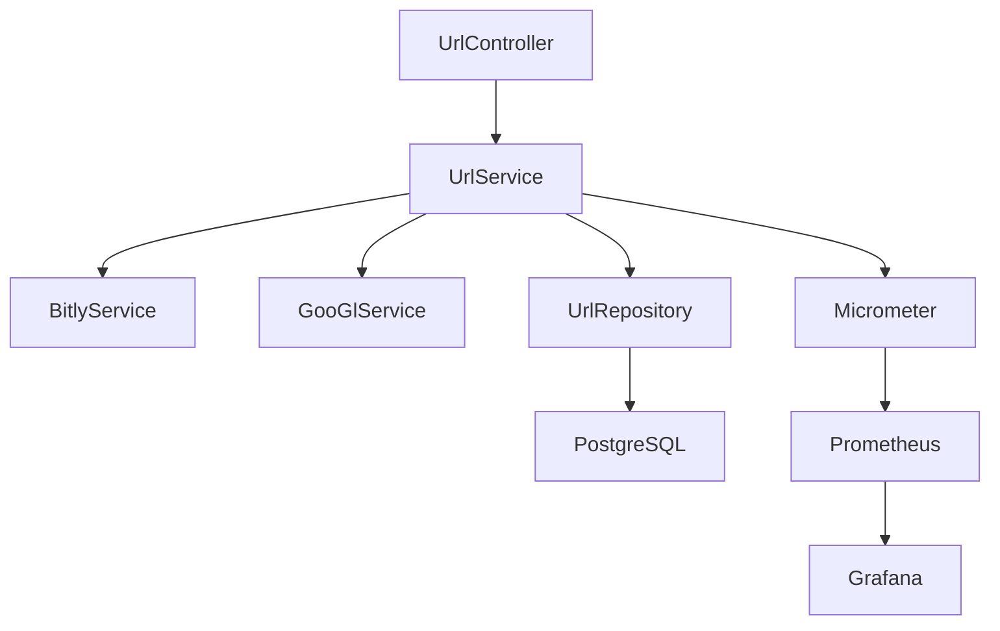

## Configuracion

### H2 Console

H2 Console es una web-bbdd interfaz para interactuar con la bbdd de H2

#### H2 Console - consola

1. en el browser ir a http://localhost:8080/h2-console
2. **Login** using the following credentials:

    - **Saved Settings**: `Generic H2 (Embedded)`
    - **Driver Class**: `org.h2.Driver`
    - **JDBC URL**: `jdbc:h2:mem:urlshortener`
    - **User Name**: `sa`
    - **Password**: (leave blank)

#### Example Configuration

Here is a summary of the configuration settings:

| Setting Name          | Value                           |
|-----------------------|---------------------------------|
| Driver Class          | `org.h2.Driver`                 |
| JDBC URL              | `jdbc:h2:mem:urlshortener`      |
| User Name             | `sa`                            |
| Password              | (leave blank)                   |

# Aplicación de Acortador de URLs

## Descripción General

La Aplicación de Acortador de URLs es un servicio web que permite a los usuarios crear versiones acortadas de URLs largas. Proporciona endpoints para acortar URLs, recuperar URLs originales, actualizar URLs y eliminar URLs. La aplicación está construida con Spring Boot e incluye la recopilación de métricas para estadísticas de acceso en tiempo casi real.

## Componentes

### 1. UrlController
- **Responsabilidad**: Maneja las solicitudes HTTP para operaciones de URL como acortar, recuperar, actualizar y eliminar URLs.
- **Por Qué Se Incluye**: Actúa como el punto de entrada para todas las interacciones del cliente con la aplicación.

### 2. UrlService
- **Responsabilidad**: Gestiona la lógica de negocio para operaciones de URL, incluyendo la creación, recuperación, actualización y eliminación de URLs.
- **Por Qué Se Incluye**: Separa la lógica de negocio del controlador, promoviendo una arquitectura limpia y mantenibilidad.

### 3. BitlyService
- **Responsabilidad**: Se integra con la API de Bitly para acortar URLs.
- **Por Qué Se Incluye**: Proporciona un servicio externo para acortar URLs, mejorando la funcionalidad.

### 4. GooGlService
- **Responsabilidad**: Se integra con la API de Acortador de URLs de Google para acortar URLs.
- **Por Qué Se Incluye**: Proporciona otro servicio externo para acortar URLs, ofreciendo flexibilidad.

### 5. UrlRepository
- **Responsabilidad**: Gestiona las operaciones de base de datos para entidades de URL.
- **Por Qué Se Incluye**: Abstrae las interacciones con la base de datos, permitiendo cambios fáciles en la capa de base de datos.

### 6. Url
- **Responsabilidad**: Representa la entidad URL en la aplicación.
- **Por Qué Se Incluye**: Modela la estructura de datos para URLs, asegurando consistencia e integridad.

### 7. Recopilación de Métricas
- **Responsabilidad**: Recopila y expone métricas para monitorear el rendimiento de la aplicación.
- **Por Qué Se Incluye**: Proporciona insights en tiempo real sobre el uso y el rendimiento de la aplicación, facilitando la resolución de problemas y la optimización.

## Infraestructura

### Base de Datos
- **Tipo**: PostgreSQL
- **Por Qué Se Eligió**:
   - **Fiabilidad**: PostgreSQL es una base de datos relacional robusta y confiable.
   - **Escalabilidad**: Soporta escalado horizontal y es adecuada para aplicaciones en crecimiento.
   - **Comunidad y Soporte**: Fuerte comunidad y documentación extensa.
- **Alternativas Consideradas**:
   - **MySQL**: Similar a PostgreSQL pero con diferentes características y licencias.
   - **MongoDB**: Una base de datos NoSQL, pero no se eligió debido a la necesidad de integridad de datos relacionales.

### Monitoreo y Métricas
- **Herramienta**: Micrometer con Prometheus y Grafana
- **Por Qué Se Eligió**:
   - **Micrometer**: Proporciona una fachada simple sobre los clientes de instrumentación para los sistemas de monitoreo más populares.
   - **Prometheus**: Una poderosa herramienta de monitoreo y alertas de código abierto.
   - **Grafana**: Una plataforma de monitoreo y observabilidad de código abierto, con una rica gama de herramientas de visualización.
- **Alternativas Consideradas**:
   - **New Relic**: Una herramienta APM completa pero con costos más altos.
   - **Datadog**: Otra herramienta APM con fuertes características pero también con costos más altos.

### Marco de Pruebas
- **Marco**: JUnit 5
- **Por Qué Se Eligió**:
   - **JUnit 5**: La última versión de JUnit, que proporciona características avanzadas como pruebas parametrizadas, pruebas anidadas y más.
- **Alternativas Consideradas**:
   - **TestNG**: Ofrece características similares pero JUnit 5 es más integrado con Spring Boot.

### Herramienta de Construcción
- **Herramienta**: Maven
- **Por Qué Se Eligió**:
   - **Maven**: Ampliamente utilizado en el ecosistema Java, con una gran comunidad y documentación extensa.
- **Alternativas Consideradas**:
   - **Gradle**: Ofrece más flexibilidad y compilaciones más rápidas pero con una curva de aprendizaje más pronunciada.

## Diagrama de Arquitectura

A continuación se muestra un diagrama de arquitectura de alto nivel de la Aplicación de Acortador de URLs.

### Explicación del Diagrama
- **UrlController**: Maneja las solicitudes HTTP e interactúa con los servicios.
- **UrlService**: Gestiona la lógica de negocio e interactúa con los repositorios.
- **BitlyService & GooGlService**: Se integran con servicios externos de acortamiento de URLs.
- **UrlRepository**: Gestiona las operaciones de base de datos.
- **PostgreSQL**: Almacena datos de URL.
- **Micrometer**: Recopila y expone métricas.
- **Prometheus**: Recopila y almacena métricas.
- **Grafana**: Visualiza métricas.

## Conclusión

La Aplicación de Acortador de URLs está diseñada para ser escalable, confiable y fácil de mantener. La elección de tecnologías y componentes asegura que la aplicación pueda manejar demandas en crecimiento mientras proporciona valiosos insights a través de monitoreo y métricas.

   
